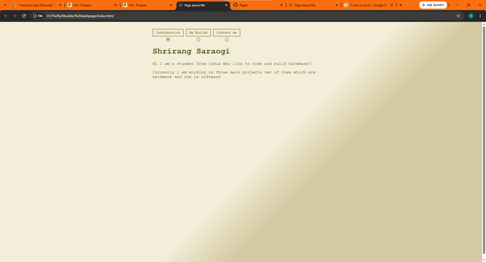

# About me site

## Screenshots

## What is this site
This is a about me site i made using html css and java script it has three pages first is about me, secnd page is about my projects and the third is about my contact
It is a simple about me site.

## Why did i built it
I bult is just to show my projects and about me
and ofcourse as it was a mission on pixl

## What does it have
- About me page
- About my projects
- contact info

## Tech stack
- HTML
- CSS
- JavaScript

## Ai usuage
# NEAT EXPLANATION ON PIXL WEBSITE (like this is also good but there its the better one)

I just used to learn the transition thng in which when pages were turned the smoth transition i was first doing it direct then i thought of a better thing with it i searched on ai for it and i got the smooth transition i have used this smooth transition in previous projects but i had forgotten the code so ha to look up in google 

## Built for

Hackclub Pixl